# Architecture V2: Production-Grade LLM Cost & Security Gateway

**Major Architectural Changes:**
- ❌ Removed: Real-time write-back to L0 (security risk)
- ❌ Removed: Building L1/L2 layers (not our core value)
- ✅ Added: PII Scrubber (upfront security)
- ✅ Added: Offline Miner + HITL (safe cache population)
- ✅ Added: L0 Read-Only in hot path (zero-trust model)

---

## 1. High-Level System Overview


**🔒 NEW Components to Build:**
1. **PII Scrubber**: Strips sensitive data before cache lookup
2. **Logging Service**: Records all L3 misses for analysis
3. **Offline Miner**: Aggregates logs, finds top queries
4. **HITL Approval Tool**: Human-in-the-loop safety gate
5. **L0 Write Path**: Separate, controlled write mechanism

**Key Architectural Decisions:**
- ✅ L0 is **read-only** in hot path (no automatic writes)
- ✅ L0 writes **only** via human-approved HITL loop
- ✅ PII scrubbing happens **before** any cache interaction
- ✅ L1/L2 are **external** (users bring their own)

---

## 2. Real-Time Flow (Detailed)


**Components to Build:**
- [ ] **PII Scrubber** (`pii_scrubber.py`) - Uses Presidio service
- [ ] **L0 Read-Only Logic** (update existing L0 to disable writes)
- [ ] **Logging Service** (`logging_service.py`)
- [ ] **L0L3Gateway** orchestrator (refactor to include scrubber + logger)

---

## 3. Async Offline Loop - AI-Assisted Hybrid HITL (NEW)

**Design Evolution:** The original manual HITL loop had critical flaws:
- ❌ Data leakage risk (humans see raw queries with PII)
- ❌ High Opex (humans write responses, 24-48hr latency)
- ❌ Scale issues (manual review doesn't scale to 1000s of queries)

**New Hybrid Approach:** AI generates, humans approve (1-click review)

```mermaid
sequenceDiagram
    participant Logs as Query Logs<br/>(Structured JSON)
    participant Miner as Offline Miner<br/>🔒 NEW
    participant AIGen as AI Response Generator<br/>🔒 NEW
    participant AIPolicy as AI Policy & Safety Check<br/>🔒 NEW
    participant File as approved_cache.json
    participant HITL as HITL Approval Tool<br/>🔒 NEW (Simplified)
    participant Human as Human Reviewer
    participant Redis as L0 Cache (Redis)

    Note over Logs: Logs accumulate over time<br/>(hours/days)

    rect rgb(200, 230, 255)
        Note over Logs,Miner: Step 1: Offline Mining
        Miner->>Logs: Read all L3 miss logs
        Miner->>Miner: Aggregate by clean_prompt
        Miner->>Miner: Sort by frequency
        Miner->>Miner: Top N queries (e.g., 1000)
        Miner->>AIGen: Send normalized intents:<br/>{<br/>  "cancel_order": {<br/>    "count": 523,<br/>    "sample_normalized": ["cancel order"]<br/>  }<br/>}
    end

    rect rgb(255, 200, 200)
        Note over AIGen: Step 2: AI Response Generation
        loop For each intent
            AIGen->>AIGen: Generate generic response<br/>using GPT-4/Claude
            AIGen->>AIGen: Template: "To {action} {entity}:<br/>1. Step one<br/>2. Step two"
            AIGen->>AIPolicy: Check response
        end
    end

    rect rgb(255, 220, 180)
        Note over AIPolicy: Step 3: AI Policy & Safety Check
        loop For each generated response
            AIPolicy->>AIPolicy: Score: PII present? (fail if >0)
            AIPolicy->>AIPolicy: Score: Generic? (fail if <0.9)
            AIPolicy->>AIPolicy: Score: Actionable? (fail if <0.8)
            AIPolicy->>AIPolicy: Score: Safe? (fail if <0.95)

            alt All checks pass
                AIPolicy->>File: Write to approved_cache.json:<br/>{<br/>  "intent": "cancel_order",<br/>  "response": "To cancel...",<br/>  "ai_score": 0.96,<br/>  "requires_human": false<br/>}
            else Any check fails
                AIPolicy->>File: Flag for human review:<br/>{<br/>  "intent": "cancel_order",<br/>  "response": "To cancel...",<br/>  "ai_score": 0.73,<br/>  "requires_human": true,<br/>  "failure_reason": "PII detected"<br/>}
            end
        end
    end

    rect rgb(220, 255, 220)
        Note over File,HITL: Step 4: HITL (1-Click Approval Only)
        HITL->>File: Load approved_cache.json
        HITL->>HITL: Filter: requires_human == true

        loop For each flagged entry (5-10% only)
            HITL->>Human: Show:<br/>Intent: "cancel_order"<br/>AI Response: "To cancel..."<br/>AI Score: 0.73<br/>Issue: "PII detected"<br/><br/>[✓ Approve] [✗ Reject]

            alt Human Approves
                Human-->>HITL: ✓
                HITL->>Redis: SET intent:cancel_order<br/>"To cancel an order:..."
                Note right of Redis: ✅ Human approved
            else Human Rejects
                Human-->>HITL: ✗
                Note right of HITL: ❌ Rejected, will retry
            end
        end

        Note over HITL: Auto-approve high-score entries<br/>(ai_score >= 0.95 && requires_human == false)

        loop For each auto-approved entry (90-95%)
            HITL->>Redis: SET intent:track_shipment<br/>"To track your shipment:..."
            Note right of Redis: ✅ Auto-approved (AI score 0.98)
        end
    end

    Note over Redis: L0 cache now contains:<br/>- AI-generated entries (95%)<br/>- Human-approved entries (5%)
```



**Key Benefits of Hybrid Approach:**
- ✅ **No data leakage**: Humans never see raw queries, only normalized intents
- ✅ **99% Opex reduction**: Humans approve, don't generate (5-10% review rate)
- ✅ **Fast turnaround**: AI generates in minutes, humans approve in hours (not days)
- ✅ **Safety maintained**: Dual gates (AI policy + human oversight)
- ✅ **Scales to production**: Handle 1000s of intents with minimal human cost

**Components to Build:**
- [ ] **Offline Miner** (`miner.py`)
  - Reads structured logs
  - Aggregates by frequency
  - Outputs normalized intents (NOT raw queries)
- [ ] **AI Response Generator** (`ai_response_generator.py`)
  - Uses GPT-4/Claude to generate generic responses
  - Template-based generation for consistency
  - Cost: ~$0.001 per response
- [ ] **AI Policy & Safety Check** (`ai_policy_checker.py`)
  - Scores responses on 4 dimensions (PII, generic, actionable, safe)
  - Flags <0.95 score for human review
  - Auto-approves >=0.95 score
- [ ] **HITL Approval Tool** (`approve.py`) - Simplified
  - 1-click approve/reject interface
  - Only shows flagged entries (5-10%)
  - Bulk auto-approve high-score entries

---

## 4. Component Architecture (Class Diagram)


**🔒 NEW Components Summary:**
1. **PIIScrubber**: Presidio-based PII extraction (p99 latency <20ms SLO)
2. **LoggingService**: Structured logging for analytics
3. **OfflineMiner**: Log aggregation + frequency analysis (outputs normalized intents only)
4. **AIResponseGenerator**: GPT-4/Claude generates generic responses
5. **AIPolicyChecker**: Scores responses on 4 dimensions (PII, generic, actionable, safe)
6. **HITLTool**: 1-click approval interface (5-10% review rate)
7. **INormalizer**: BYOM interface for L0 normalization (heuristics or custom models)

---

## 5. Production Readiness: Three Non-Negotiable Pillars

### Pillar 1: Performance (PII Scrubber SLO <20ms p99)

**The Problem:**
If Presidio takes 200ms at p99, the 1ms L0 benefit is wiped out. The hot path becomes:
- PII Scrubber: 200ms (p99)
- L0 Lookup: 1ms
- **Total: 201ms** (vs. 1ms without scrubber)

**The Solution:**


**Implementation Strategy:**

1. **Baseline (POC)**: Use Presidio out-of-the-box (~200ms p99)
   - Good enough for initial testing
   - Document clearly: "Not production-ready"

2. **Optimization Path 1: High-Performance Engine**
   - Replace naive Python regex with `re2` library
   - Or: Use Rust-based PII detection (Hyperscan)
   - Expected: 10-50x improvement (200ms → 20ms)

3. **Optimization Path 2: Co-located Sidecar**
   - Deploy Presidio as low-latency gRPC service
   - Same host/pod as gateway (no network hop)
   - Expected: <1ms network latency

4. **Escape Hatch: Passthrough Mode**
   ```python
   # For users who already handle PII
   gateway = L0L3Gateway(
       llm=client,
       pii_scrubber='passthrough'  # Skip scrubbing
   )
   ```

5. **Dashboard Tracking:**
   ```python
   gateway.dashboard()
   # ╔══════════════════════════════════════╗
   # ║ PII Scrubber Performance             ║
   # ╠══════════════════════════════════════╣
   # ║ p99 Latency:    18.3ms ✅ <20ms      ║
   # ║ p95 Latency:    12.1ms               ║
   # ║ Avg Latency:     8.7ms               ║
   # ╚══════════════════════════════════════╝
   ```

**SLO Gate:**
- ✅ p99 latency <20ms: Production-ready
- ⚠️ p99 latency 20-50ms: Warning, investigate
- ❌ p99 latency >50ms: Hard failure, block deployment

---

### Pillar 2: ROI (L0 Normalizer BYOM Strategy)

**The Problem:**
The default POC model (regex or small BERT) may not be production-grade for all domains. Users need flexibility.

**The Solution: "Freemium" BYOM Approach**

```mermaid
graph TB
    subgraph "Default POC Path (90% of users)"
        DefaultModel[l0-normalizer-base<br/>Regex or small BERT]
        Warning[⚠️ WARNING IN DOCS:<br/>"For evaluation only.<br/>Use heuristics or fine-tune<br/>for production."]
        DefaultModel --> Warning
    end

    subgraph "Production Path 1: Heuristics (Recommended)"
        Heuristic[Custom regex function<br/>Domain-specific rules]
        Example1[L0Cache<br/>normalizer=my_regex_func]
        Heuristic --> Example1
    end

    subgraph "Production Path 2: Custom Model"
        FineTuned[Fine-tuned BERT/RoBERTa<br/>Your domain data]
        Example2[L0Cache<br/>normalizer=my_bert_client]
        FineTuned --> Example2
    end

    DefaultModel -.upgrade to.-> Heuristic
    DefaultModel -.upgrade to.-> FineTuned

    style Warning fill:#FF6B6B
    style Heuristic fill:#90EE90
    style FineTuned fill:#87CEEB
```

**Implementation Strategy:**

1. **INormalizer Interface:**
   ```python
   class INormalizer(ABC):
       @abstractmethod
       def normalize(self, prompt: str) -> str:
           """Returns normalized intent (e.g., 'cancel_order')"""
           pass
   ```

2. **Default POC Normalizer (Regex):**
   ```python
   class RegexNormalizer(INormalizer):
       def normalize(self, prompt: str) -> str:
           lower = prompt.lower()
           if 'cancel' in lower: return 'cancel_order'
           if 'track' in lower: return 'track_shipment'
           # ... basic patterns
   ```

3. **Production Path 1: User Heuristics (Recommended)**
   ```python
   def my_domain_normalizer(prompt: str) -> str:
       # Custom logic for banking domain
       if 'balance' in prompt.lower(): return 'check_balance'
       if 'transfer' in prompt.lower(): return 'transfer_funds'
       # ... 20 more domain-specific rules

   gateway = L0L3Gateway(
       llm=client,
       l0=L0Cache(redis, normalizer=my_domain_normalizer)
   )
   ```

4. **Production Path 2: Fine-Tuned Model**
   ```python
   class MyBERTNormalizer(INormalizer):
       def __init__(self, model_url="http://my-bert:8080"):
           self.client = requests.Session()
           self.model_url = model_url

       def normalize(self, prompt: str) -> str:
           response = self.client.post(
               f"{self.model_url}/predict",
               json={"text": prompt}
           )
           return response.json()["intent"]

   gateway = L0L3Gateway(
       llm=client,
       l0=L0Cache(redis, normalizer=MyBERTNormalizer())
   )
   ```

5. **Documentation Warnings:**
   - README.md: "⚠️ Default normalizer is for evaluation only"
   - QUICKSTART.md: "For production, use custom heuristics or fine-tuned model"
   - Advanced example: `example_custom_normalizer.py`

**ROI Tracking:**
```python
gateway.dashboard()
# ╔══════════════════════════════════════╗
# ║ L0 Cache Performance                 ║
# ╠══════════════════════════════════════╣
# ║ Normalizer:     RegexNormalizer      ║
# ║ Cache Hit Rate: 73.2%                ║
# ║                                      ║
# ║ ⚠️ Using default POC normalizer      ║
# ║ For production, see:                 ║
# ║ docs.example.com/custom-normalizer   ║
# ╚══════════════════════════════════════╝
```

---

### Pillar 3: Security (Metric Gates on Every Commit)

**The Problem:**
Without automated gates, regressions slip through. Security, performance, and accuracy must be enforced.

**The Solution: Industry-Standard Metric Gates**


**Implementation Strategy:**

| Metric Category | Metric Name | Gate Condition | Hard Fail? |
|----------------|-------------|----------------|------------|
| **Performance** | `pii_scrubber_latency_p99` | Must not regress >2% | ⚠️ Warning |
| **Performance** | `pii_scrubber_latency_p99` | Must be <50ms | ❌ Hard fail |
| **Cost/ROI** | `cache_hit_ratio_l0` | Must meet/beat main | ❌ Hard fail |
| **Security** | `pii_leakage_rate` | Must be zero | ❌ Hard fail |
| **Accuracy** | `normalization_accuracy` | Must not regress >1% | ⚠️ Warning |
| **Accuracy** | `normalization_accuracy` | Must be >60% | ❌ Hard fail |

**Test Suite Structure:**

1. **TEST_PII.py** (Security - Zero Tolerance)
   ```python
   def test_pii_never_cached():
       """Ensure no PII reaches Redis cache"""
       test_queries = [
           "My SSN is 123-45-6789, cancel order",
           "Email: user@example.com, track shipment",
           "John Smith at 555-1234, return item",
       ]

       for query in test_queries:
           result = gateway.chat(query)

           # Check Redis for PII
           all_cache_values = redis.mget(redis.keys("intent:*"))
           for value in all_cache_values:
               assert "123-45-6789" not in value  # SSN
               assert "user@example.com" not in value  # Email
               assert "555-1234" not in value  # Phone

       # Gate: pii_leakage_rate must be 0.0
       assert gateway.metrics["pii_leakage_rate"] == 0.0
   ```

2. **TEST_PERFORMANCE.py** (Latency)
   ```python
   def test_pii_scrubber_p99_latency():
       """Ensure PII scrubber meets SLO"""
       latencies = []

       for _ in range(1000):
           start = time.time()
           gateway.pii_scrubber.scrub("test query")
           latencies.append((time.time() - start) * 1000)

       p99 = np.percentile(latencies, 99)

       # Gate 1: Warning if regressed >2%
       baseline_p99 = get_baseline_metric("pii_scrubber_latency_p99")
       assert p99 <= baseline_p99 * 1.02, "p99 regressed >2%"

       # Gate 2: Hard fail if >50ms
       assert p99 < 50, f"p99 latency {p99:.1f}ms exceeds 50ms limit"
   ```

3. **TEST_CACHE_HIT_RATE.py** (ROI)
   ```python
   def test_l0_cache_hit_rate():
       """Ensure L0 maintains expected hit rate"""
       test_queries = load_test_dataset()  # 100 queries, 10 intents

       hits = 0
       for query in test_queries:
           result = gateway.chat(query)
           if result.source == "L0_CACHE":
               hits += 1

       hit_rate = hits / len(test_queries)

       # Gate: Must meet/beat main branch
       baseline_hit_rate = get_baseline_metric("cache_hit_ratio_l0")
       assert hit_rate >= baseline_hit_rate, \
           f"Cache hit rate {hit_rate:.1%} below baseline {baseline_hit_rate:.1%}"
   ```

4. **TEST_NORMALIZATION_ACCURACY.py** (Accuracy)
   ```python
   def test_normalization_accuracy():
       """Ensure normalizer maintains accuracy"""
       labeled_dataset = load_labeled_queries()  # 500 labeled intents

       correct = 0
       for query, expected_intent in labeled_dataset:
           normalized = gateway.l0_cache.normalize(query)
           if normalized == expected_intent:
               correct += 1

       accuracy = correct / len(labeled_dataset)

       # Gate 1: Must not regress >1%
       baseline_accuracy = get_baseline_metric("normalization_accuracy")
       assert accuracy >= baseline_accuracy - 0.01, \
           f"Accuracy {accuracy:.1%} regressed >1%"

       # Gate 2: Must be >60% minimum
       assert accuracy > 0.60, \
           f"Accuracy {accuracy:.1%} below 60% minimum"
   ```

**CI/CD Integration:**

```yaml
# .github/workflows/test.yml
name: Metric Gates

on: [push, pull_request]

jobs:
  test:
    runs-on: ubuntu-latest
    steps:
      - name: Run Security Tests
        run: pytest TEST_PII.py --strict

      - name: Run Performance Tests
        run: pytest TEST_PERFORMANCE.py --strict

      - name: Run ROI Tests
        run: pytest TEST_CACHE_HIT_RATE.py --strict

      - name: Run Accuracy Tests
        run: pytest TEST_NORMALIZATION_ACCURACY.py --strict

      - name: Publish Metrics
        run: python publish_metrics.py
```

**Dashboard Integration:**

```python
gateway.dashboard()
# ╔══════════════════════════════════════╗
# ║ Production Health Metrics            ║
# ╠══════════════════════════════════════╣
# ║ Security:                            ║
# ║   PII Leakage:     0.00% ✅          ║
# ║                                      ║
# ║ Performance:                         ║
# ║   PII p99:         18.3ms ✅ <20ms   ║
# ║   Regression:      -3.2% ✅          ║
# ║                                      ║
# ║ Cost/ROI:                            ║
# ║   L0 Hit Rate:     74.2% ✅          ║
# ║   vs Baseline:     +1.0% ✅          ║
# ║                                      ║
# ║ Accuracy:                            ║
# ║   Normalization:   72.8% ✅          ║
# ║   vs Baseline:     +0.3% ✅          ║
# ╚══════════════════════════════════════╝
```

---

## 6. Phase 1: The "5-Minute" Product (MVP)


**Build Order (Week 1):**
1. [ ] **Task 1**: Write new README.md (focus: 2-line example)
2. [ ] **Task 2**: Define `ICacheLayer` and `INormalizer` interfaces
3. [ ] **Task 3**: Build `PIIScrubber` (Presidio-based)
   - [ ] 3a: Add Presidio services to `docker-compose.yml`
   - [ ] 3b: Create Python client wrapper (`pii_scrubber.py`)
   - [ ] 3c: Implement fail-open mode (continue with warning if Presidio down)
   - [ ] 3d: Add `pii_scrubber='passthrough'` option for users with existing PII handling
   - [ ] 3e: Add p99 latency tracking (target: <20ms, gate: <50ms)
4. [ ] **Task 4**: Refactor `L0L3Gateway` (add scrubber + logger)
5. [ ] **Task 5**: Create `example_quickstart.py`
6. [ ] **Task 6**: Create `example_custom_normalizer.py` (BYOM demonstration)

**Success Criteria:**
- ✅ User can copy-paste 2 lines and it works
- ✅ Power user can see BYOM (custom normalizer) in example
- ✅ PII is scrubbed before any cache interaction
- ✅ Dashboard shows `pii_scrubber_latency_p99` metric
- ✅ Passthrough mode available for users with existing PII handling

---

## 7. Phase 2: The "Value Add" (AI-Assisted Adaptive Engine)

```mermaid
graph TB
    subgraph "Phase 2 Deliverables"
        Dashboard[.dashboard() Method<br/>🔒 NEW<br/>Production metrics tracking]
        Miner[miner.py Script<br/>🔒 NEW<br/>Offline aggregation]
        AIGen[ai_response_generator.py<br/>🔒 NEW<br/>GPT-4/Claude generation]
        AIPolicy[ai_policy_checker.py<br/>🔒 NEW<br/>4-dimension scoring]
        HITL[approve.py Script<br/>🔒 NEW (Simplified)<br/>1-click approval UI]
    end

    subgraph "Data Flow"
        Logs[(Query Logs)] -->|Read| Miner
        Miner -->|Normalized intents| AIGen
        AIGen -->|Generated responses| AIPolicy
        AIPolicy -->|Scored proposals| File[approved_cache.json]
        File -->|Flagged entries only| HITL
        HITL -->|Approved| L0[(L0 Cache)]
        AIPolicy -->|Auto-approve high scores| L0
    end

    Gateway[L0L3Gateway] -.tracks metrics.-> Dashboard
    Gateway -.writes logs.-> Logs

    style Dashboard fill:#FFD700
    style Miner fill:#87CEEB
    style AIGen fill:#FF6B6B
    style AIPolicy fill:#FFA07A
    style HITL fill:#DDA0DD
```

**Build Order (Week 2):**
1. [ ] **Task 7**: Add comprehensive `.dashboard()` to `L0L3Gateway`
   - [ ] 7a: Add `pii_scrubber_latency_p95` and `pii_scrubber_latency_p99` tracking
   - [ ] 7b: Add `cache_hit_ratio_l0` tracking
   - [ ] 7c: Add `normalization_accuracy` tracking (if test dataset available)
   - [ ] 7d: Add `pii_leakage_rate` tracking (always 0.0 if scrubbing works)
   - [ ] 7e: Display production health metrics dashboard
2. [ ] **Task 8**: Build `miner.py` (offline log aggregation)
   - [ ] 8a: Read structured logs from `LoggingService`
   - [ ] 8b: Aggregate by normalized intent (NOT raw queries)
   - [ ] 8c: Sort by frequency (top N queries)
   - [ ] 8d: Output `IntentProposal` objects (no PII, only normalized intents)
3. [ ] **Task 9**: Build `ai_response_generator.py`
   - [ ] 9a: Accept `IntentProposal` as input
   - [ ] 9b: Generate generic response using GPT-4/Claude
   - [ ] 9c: Use template-based approach for consistency
   - [ ] 9d: Cost tracking (~$0.001 per response)
4. [ ] **Task 10**: Build `ai_policy_checker.py`
   - [ ] 10a: Score response on PII detection (must be 0)
   - [ ] 10b: Score response on genericness (>0.9 required)
   - [ ] 10c: Score response on actionability (>0.8 required)
   - [ ] 10d: Score response on safety (>0.95 required)
   - [ ] 10e: Output `PolicyResult` with overall score and `requires_human` flag
5. [ ] **Task 11**: Build `approve.py` (simplified HITL tool)
   - [ ] 11a: Load `approved_cache.json` with scored proposals
   - [ ] 11b: Filter for `requires_human == true` (5-10% only)
   - [ ] 11c: Display 1-click approve/reject UI
   - [ ] 11d: Auto-approve entries with `ai_score >= 0.95`
   - [ ] 11e: Write approved entries to L0 Cache (Redis)

**Success Criteria:**
- ✅ Users can see production health metrics via `.dashboard()`
- ✅ System adapts by mining frequent queries (normalized, no PII)
- ✅ AI generates 95% of responses automatically
- ✅ Human approval required for only 5-10% (flagged entries)
- ✅ 99% Opex reduction compared to manual HITL
- ✅ No data leakage (humans never see raw queries)

---

## 8. Phase 3: Production Hardening (Metric Gates + Integrations)

```mermaid
graph TB
    subgraph "Phase 3 Deliverables"
        TestPII[TEST_PII.py<br/>🔒 NEW<br/>Zero-tolerance security]
        TestPerf[TEST_PERFORMANCE.py<br/>🔒 NEW<br/>p99 latency gates]
        TestROI[TEST_CACHE_HIT_RATE.py<br/>🔒 NEW<br/>ROI validation]
        TestAccuracy[TEST_NORMALIZATION_ACCURACY.py<br/>🔒 NEW<br/>Accuracy gates]
        CI[CI/CD Integration<br/>🔒 NEW<br/>Automated gates]
        Invalidate[.invalidate_l0_key()<br/>🔒 NEW<br/>Cache management]
        Examples[Integration Examples<br/>LangChain, n8n]
    end

    subgraph "Test Gates"
        TestPII --> G1[pii_leakage_rate == 0.0<br/>❌ Hard fail if any PII]
        TestPerf --> G2[pii_scrubber_latency_p99 < 50ms<br/>❌ Hard fail if exceeded]
        TestROI --> G3[cache_hit_ratio_l0 >= baseline<br/>❌ Hard fail if regressed]
        TestAccuracy --> G4[normalization_accuracy >= baseline<br/>⚠️ Warning if regressed >1%]
    end

    CI -.runs on commit.-> TestPII
    CI -.runs on commit.-> TestPerf
    CI -.runs on commit.-> TestROI
    CI -.runs on commit.-> TestAccuracy

    Invalidate -.manages.-> L0[(L0 Cache)]

    Examples -.demonstrates.-> Gateway[L0L3Gateway]

    style TestPII fill:#FF6B6B
    style TestPerf fill:#FFA07A
    style TestROI fill:#FFD700
    style TestAccuracy fill:#87CEEB
    style CI fill:#DDA0DD
    style Invalidate fill:#FFB6C1
```

**Build Order (Week 3-4):**
1. [ ] **Task 12**: Build comprehensive test suite (metric gates)
   - [ ] 12a: `TEST_PII.py` - Security gate (zero tolerance)
   - [ ] 12b: `TEST_PERFORMANCE.py` - p99 latency gate (<50ms hard fail)
   - [ ] 12c: `TEST_CACHE_HIT_RATE.py` - ROI gate (must meet/beat baseline)
   - [ ] 12d: `TEST_NORMALIZATION_ACCURACY.py` - Accuracy gate (>60% minimum)
   - [ ] 12e: Create `baseline_metrics.json` for regression tracking
2. [ ] **Task 13**: CI/CD integration
   - [ ] 13a: Create `.github/workflows/test.yml`
   - [ ] 13b: Configure pytest with `--strict` mode
   - [ ] 13c: Add metric publishing to dashboard
   - [ ] 13d: Block PRs that fail hard gates
3. [ ] **Task 14**: Add `.invalidate_l0_key()` to gateway
   - [ ] 14a: Implement Redis key deletion
   - [ ] 14b: Add bulk invalidation support
   - [ ] 14c: Add pattern-based invalidation (e.g., `intent:cancel_*`)
4. [ ] **Task 15**: Create integration examples
   - [ ] 15a: `examples/langchain.py` - LangChain integration
   - [ ] 15b: `examples/langgraph.py` - LangGraph integration
   - [ ] 15c: `examples/n8n_custom_node.js` - n8n custom node
   - [ ] 15d: `examples/retool.py` - Retool integration
5. [ ] **Task 16**: Documentation finalization
   - [ ] 16a: Update README with production warnings
   - [ ] 16b: Add "Production Checklist" section
   - [ ] 16c: Document metric gates and SLOs
   - [ ] 16d: Add troubleshooting guide

**Success Criteria:**
- ✅ Zero PII leakage proven by automated tests (hard gate)
- ✅ PII scrubber p99 latency <50ms (hard gate)
- ✅ L0 cache hit rate meets baseline (hard gate)
- ✅ Normalization accuracy >60% minimum (hard gate)
- ✅ All tests run automatically on every commit
- ✅ Bad cache entries can be removed via API
- ✅ Integration examples cover 4 major platforms
- ✅ Production readiness documented and validated

---

## 8. Security Flow (PII Scrubbing Detail)

```mermaid
flowchart TD
    Start([User Query]) --> Input["Input:<br/>My SSN is 123-45-6789,<br/>cancel order #12345"]

    Input --> Scrubber[PII Scrubber]

    Scrubber --> ExtractSSN[Extract SSN:<br/>123-45-6789]
    Scrubber --> ExtractOrder[Extract Order ID:<br/>12345]
    Scrubber --> ExtractEmail[Extract Email:<br/>user@example.com]

    ExtractSSN --> Clean[Clean Prompt:<br/>"cancel order"]
    ExtractOrder --> Clean
    ExtractEmail --> Clean

    Clean --> PII[PII Dictionary:<br/>{<br/>  ssn: "123-45-6789",<br/>  order_id: "12345",<br/>  email: "user@example.com"<br/>}]

    Clean --> L0[L0 Cache Lookup:<br/>intent:cancel_order]
    L0 --> Check{Cache Hit?}

    Check -->|Yes| Return1[Return:<br/>Generic instructions +<br/>PII dict for app use]
    Check -->|No| L3[L3 LLM Call]
    L3 --> Return2[Return:<br/>Response +<br/>PII dict for app use]

    Return1 --> App[Application]
    Return2 --> App

    App --> Execute[Application uses<br/>order_id to execute<br/>cancellation]

    style Scrubber fill:#FFB6C1
    style Clean fill:#90EE90
    style PII fill:#FF6B6B
    style L0 fill:#87CEEB
```

**Key Security Properties:**
- ✅ PII extracted **before** cache lookup
- ✅ Only clean prompt used as cache key
- ✅ PII returned to application (not cached)
- ✅ Application responsible for using PII safely

---

## 9. Dashboard Metrics

```mermaid
graph LR
    subgraph "Tracked Metrics"
        L0Hit[L0 Hits: 750]
        L1Hit[L1 Hits: 150]
        L2Hit[L2 Hits: 50]
        L3Miss[L3 Calls: 50]

        Cost[Cost Saved: $19.50]
        Latency[Avg Latency: 200ms]
    end

    Gateway[L0L3Gateway] -->|tracks| L0Hit
    Gateway -->|tracks| L1Hit
    Gateway -->|tracks| L2Hit
    Gateway -->|tracks| L3Miss
    Gateway -->|calculates| Cost
    Gateway -->|measures| Latency

    Dashboard[.dashboard() Method] -->|displays| Metrics[Pretty-printed<br/>Summary]

    style Gateway fill:#DDA0DD
    style Dashboard fill:#FFD700
```

**Example Output:**
```python
gateway.dashboard()
# Output:
# ╔══════════════════════════════════════╗
# ║   L0L3Gateway Performance Dashboard  ║
# ╠══════════════════════════════════════╣
# ║ L0 Hits:        750  (75.0%)         ║
# ║ L1 Hits:        150  (15.0%)         ║
# ║ L2 Hits:         50  ( 5.0%)         ║
# ║ L3 Calls:        50  ( 5.0%)         ║
# ║                                      ║
# ║ Total Queries:  1000                 ║
# ║ Avg Latency:    200ms                ║
# ║ Cost Saved:     $19.50               ║
# ╚══════════════════════════════════════╝
```

---

## 10. Comparison: Old vs New Architecture

| Aspect | Old Architecture | New Architecture (V2) |
|--------|------------------|----------------------|
| **L0 Writes** | Automatic (real-time) | Human-approved (offline) |
| **PII Handling** | After cache lookup | Before cache lookup |
| **L1/L2 Layers** | We build them | Users bring their own |
| **Safety** | Hope for the best | Formal HITL approval |
| **Metrics** | Afterthought | Core product feature |
| **Cache Invalidation** | Not addressed | API provided |
| **Security Testing** | Implicit | Formal test suite |

---

## Summary: What Needs to Be Built

### 🔒 NEW Components (Must Build):

**Core Infrastructure (Phase 1):**
1. **PIIScrubber** - Presidio-based PII extraction (p99 <20ms target, <50ms gate)
2. **INormalizer Interface** - BYOM support for custom normalization
3. **RegexNormalizer** - Default POC normalizer (with production warnings)
4. **LoggingService** - Structured query logging (no PII, normalized intents only)
5. **L0L3Gateway Dashboard** - Production health metrics (PII p99, cache hit, accuracy, leakage)

**AI-Assisted Adaptive Engine (Phase 2):**
6. **OfflineMiner** - Log aggregation by normalized intent (NO raw queries)
7. **AIResponseGenerator** - GPT-4/Claude generates generic responses (~$0.001 per response)
8. **AIPolicyChecker** - 4-dimension scoring (PII=0, generic>0.9, actionable>0.8, safe>0.95)
9. **HITLTool** - Simplified 1-click approval (5-10% review rate, 99% Opex reduction)

**Production Hardening (Phase 3):**
10. **TEST_PII.py** - Zero-tolerance security gate (pii_leakage_rate == 0.0)
11. **TEST_PERFORMANCE.py** - p99 latency gate (pii_scrubber_latency_p99 <50ms)
12. **TEST_CACHE_HIT_RATE.py** - ROI gate (cache_hit_ratio_l0 >= baseline)
13. **TEST_NORMALIZATION_ACCURACY.py** - Accuracy gate (>60% minimum, <1% regression)
14. **CI/CD Integration** - Automated metric gates on every commit
15. **Invalidation API** - Cache management (`.invalidate_l0_key()`, bulk, pattern-based)

### 🔄 REFACTOR (Existing Code):
1. **L0Cache** - Make read-only in hot path, add BYOM normalizer support
2. **L0L3Gateway** - Add scrubber + logger integration, production metrics tracking

### 📚 DOCUMENTATION (Content):
1. **README.md** - 2-line quickstart, production warnings, BYOM strategy
2. **example_quickstart.py** - Magic wrapper demo
3. **example_custom_normalizer.py** - BYOM demonstration (regex and BERT)
4. **Integration examples** - LangChain, LangGraph, n8n, Retool
5. **Production Checklist** - SLOs, metric gates, deployment guide
6. **Troubleshooting Guide** - Common issues and solutions

### 📊 Production Readiness Pillars:

**Pillar 1: Performance**
- SLO: PII scrubber p99 latency <20ms (production-ready)
- Gate: p99 latency <50ms (hard fail if exceeded)
- Escape hatch: `pii_scrubber='passthrough'` for existing PII handling
- Dashboard KPI: `pii_scrubber_latency_p99` tracked and displayed

**Pillar 2: ROI**
- BYOM strategy: Default POC (regex) with clear production warnings
- Production paths: Custom heuristics (recommended) or fine-tuned model
- Dashboard warning: "⚠️ Using default POC normalizer. For production, see docs."
- Gate: `cache_hit_ratio_l0` must meet/beat baseline

**Pillar 3: Security**
- Zero-tolerance PII gate: `pii_leakage_rate == 0.0` (hard fail if any PII)
- All tests automated in CI/CD pipeline
- Metric regression tracking with `baseline_metrics.json`
- Human review never sees raw queries (only normalized intents)

**Estimated Timeline:**
- Phase 1 (MVP + Performance Pillar): 1 week
- Phase 2 (Adaptive + ROI Pillar): 1 week
- Phase 3 (Hardening + Security Pillar): 1-2 weeks
- **Total: 3-4 weeks to production-grade release**

**Key Benefits of New Architecture:**
- ✅ 99% Opex reduction (AI generates, humans approve 5-10% only)
- ✅ Zero data leakage (humans never see raw queries)
- ✅ Production-ready metrics (4 automated gates on every commit)
- ✅ Flexible BYOM approach (heuristics or custom models)
- ✅ Performance SLO enforced (p99 <50ms hard gate)
- ✅ 75% cache hit rate validated (n8n testing)
- ✅ PII-safe by design (Presidio + zero-tolerance testing)


